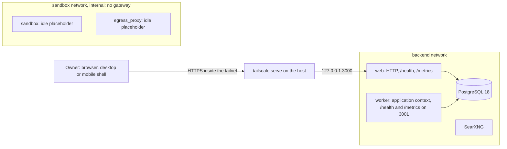

# Architecture

This document is the standing description of the system. The product requirements and the
architecture come from the owner's brief, and every statement in them is a decision. The sections
marked "Current state" say what exists today. `docs/roadmap.md` says when the rest arrives.

## Purpose

A single-player game that is also a real work tool. The owner runs a small company staffed by AI
agents. Each agent is a character in a semi low poly 3D world. When an agent has a task, its
character moves, works at a desk, and walks over to other agents to hand off work or share
findings. The owner is the only human and sits at the top of the hierarchy. The owner recruits
agents from a virtual desktop computer inside the game, gives each one a role, a job description
and its own LLM connection, assigns work, talks to any agent directly, and reads their reports.

The agents do real work with real LLM calls. The 3D world is a live view of that work, never a
separate simulation with made-up activity.

The system is online only. It runs as one monolith on one private server that only the owner can
reach through a VPN. Nothing is exposed to the public internet. It scales vertically with the
workload the owner gives the agents.

## Current state (phase 0)



- One image, `ghcr.io/johnfilhmar/tbn_game/backend`, built from the root `Dockerfile`. It runs
  `dist/web.js`, `dist/worker.js`, the healthcheck probe `dist/healthcheck.js <process_type>`, and
  the Prisma CLI for the migration release step. The runtime base is distroless Node 24, with no
  shell, running as uid 65532.
- `web` serves `GET /health` and `GET /metrics` with helmet, an explicit CORS origin list and body
  size limits.
- `worker` runs as a Nest application context, so no controller is ever mounted in it. A small
  `node:http` listener in `lib/ops_server` serves its `/health` and `/metrics`.
- `/health` answers 200 when PostgreSQL answers `SELECT 1` within 2 seconds and 503 otherwise. Its
  body matches `HealthResponseSchema` in `@tbn/contracts`.
- Both processes log JSON lines to stdout, with `process_type`, `commit_sha`, a request id taken
  from a safe `x-request-id` header or generated, and redaction of credentials in headers.
- Both close cleanly on SIGTERM: Nest shutdown hooks run, the process exits 0, and it exits 1 when
  closing takes longer than `SHUTDOWN_TIMEOUT_MS`.
- The seven domain modules exist and are empty. Prisma has an empty schema and no migrations.
- `sandbox` and `egress_proxy` are idle, locked-down placeholders on the internal `sandbox`
  network. Their healthchecks assert that they run as non-root, on a read-only root, with no
  capabilities. Nothing listens, so sandbox egress fails closed until phase 1c replaces both.
- `searxng` runs the upstream image with `deploy/searxng/settings.yml`. It is not used yet.

## Backend

One NestJS application in `backend/`, TypeScript strict, built as one image that runs as two
process types: `web` for HTTP and WebSocket, `worker` for agent runs. Scaling up means a bigger
server and a higher worker concurrency setting.

```
backend/src/
  modules/
    identity/     owner login and session
    company/      departments, agents, roster, tasks, approvals, merge requests, reports
    runtime/      run loop, checkpoints, providers, usage caps, tools, caches
    knowledge/    instructions, skills, plugins, preferences
    integrations/ request templates, notification channels
    world/        environments, appearance, time of day
    events/       event log, WebSocket gateway
  config/  lib/  utils/
```

- Inside a module: `services/`, `repositories/`, `repositories/interface/`, `dto/`, `types/`,
  `interfaces/`. Controllers validate, delegate and map. Services depend on repository interfaces.
- A module calls another module only through its exported service. No module queries another
  module's tables.
- One PostgreSQL database through Prisma. Every schema change ships with its migration in the same
  commit.
- PostgreSQL is the only backing service. The job queue is `pg-boss`. The worker tells the web
  process about new events with `LISTEN` and `NOTIFY`. No Redis, no message broker.
- Client realtime: Socket.IO.

### Ceilings

One process and one database are assumed in these places. Each carries a comment in the code.

- One PostgreSQL server holds all state. Each web and worker process opens up to
  `DATABASE_POOL_MAX` connections, so processes times pool size must stay below `max_connections`.
- From phase 2, `LISTEN` and `NOTIFY` carry events from the worker to the web process, which
  assumes one database and a small number of web processes.

## Events and realtime

- Every state change the client cares about is appended to an event log table in the same
  transaction as the change, with a sequence number that only increases.
- The gateway pushes events over Socket.IO. On connect or reconnect, a client sends its last
  sequence number and receives everything after it. Model output streams to the agent chat as
  transient events that are not replayed.
- The client applies an event by writing into the TanStack Query cache directly. No polling, and no
  broad cache invalidation in response to an event.
- Every command accepts a client-generated id and is idempotent on it, so a retry after a dropped
  connection cannot recruit or assign twice.

## Twelve-factor rules

- One codebase, many deploys. The image built in CI is the image that runs everywhere.
- Dependencies declared and pinned. Lockfiles committed.
- Config only from environment variables, parsed once at bootstrap by a schema into a typed config
  object. No `process.env` reads anywhere else.
- PostgreSQL and every LLM, search and plugin endpoint are attached resources reached by URL.
- Build, release and run are separate stages. Migrations run as a one-off release step, never on
  application boot.
- Processes are stateless. Run state, sessions and transcripts live in PostgreSQL. Files live on
  the workspace volume.
- Each process type binds its own port and exposes `/health` and Prometheus metrics.
- Fast startup and graceful shutdown. On SIGTERM the worker stops taking runs, checkpoints the one
  in flight, and exits.
- Development and production use the same compose shape and the same backing services.
- Logs are structured JSON on stdout with a correlation id that follows a task across runs. Keys
  and tokens are redacted.
- Admin tasks such as seeding and backfills are one-off commands in the same image.

## Network and security

The perimeter is the VPN. The agents are the main risk, because they read untrusted web content
and can run code.

### Inbound

- The server firewall denies all inbound traffic except the VPN. SSH is reachable only over the
  VPN.
- The VPN is Tailscale, with `tailscale serve` giving the app an HTTPS address inside the VPN. The
  browser needs a secure context for the 3D renderer, so plain HTTP on a VPN address is not enough.
- Compose publishes ports on `127.0.0.1` only. Docker bypasses host firewall rules for published
  ports, so a port published on all interfaces is a defect. `scripts/check_compose_ports.sh`
  enforces this in CI.
- A single owner account with a password hashed by argon2 and a short-lived session token. A global
  auth guard with an explicit `@Public()` decorator. WebSocket connections authenticate with the
  same token. Rotation is deferred to the online phase.
- `helmet`, an explicit CORS origin list, global validation that rejects unknown fields, and
  payload size limits stay on.

### Agent egress

- Agent code runs in a sandbox container with no service credentials, no docker socket, a
  read-only root filesystem, dropped capabilities, and CPU, memory and time limits.
- The sandbox sits on its own network. It cannot open a connection to the app, the database, the
  host, or the VPN address range.
- All outbound traffic from the sandbox and from the web fetch tool goes through one forward proxy.
  The proxy allows public addresses on ports 80 and 443 and refuses private ranges, loopback,
  link-local, the cloud metadata address, and the VPN range. It resolves names itself and checks
  the resolved address, so a public name pointing at a private address is refused. It logs every
  request with the agent and run id, and enforces size and rate limits.
- The fetch tool returns extracted text with a size cap, never raw responses.
- Phase 1c designs the sandbox and the proxy, and the owner approves the design before it is built.

### Hostile content

- Text from a web page, a file, a plugin or another agent is data. It cannot change an agent's tool
  policy, caps, skills or approval requirements. Only the owner's commands can.
- A run that has read web or plugin content is marked tainted. In a tainted run every tool that
  acts outside the server needs the owner's approval, even if its policy is `auto`. The approval
  screen shows the exact payload and the sources the run read.
- Credentials for integrations and plugins are held by the runtime and applied by the tool executor
  in the worker. They never enter the model context or the sandbox filesystem.
- Agents cannot edit instructions, skills, plugins, providers or policies.
- Error responses leak no stack traces.

## Clients

One web client is the whole game. Desktop and mobile are thin shells around the same build.

```
backend/
client/      Vite, React 19, TypeScript, Tailwind v4, the game and the virtual desktop
desktop/     Tauri v2 shell for Windows, macOS and Linux
mobile/      Capacitor shell for Android and iOS
packages/
  contracts/   Zod schemas and inferred types for every API and event payload
```

- Engine: Three.js through React Three Fiber, with Rapier for the character controller and a
  navigation mesh library for NPC pathfinding. Chosen over Godot because the 2D virtual desktop is
  half the product and belongs in React, one build serves all three platforms, and a browser client
  can be verified with Playwright screenshots.
- Game code lives in `client/src/game/`. The virtual desktop screens are ordinary React routes
  rendered in an overlay above the canvas.
- Server state in TanStack Query. Hot game state such as camera mode, selection and NPC animation
  state in small Zustand stores under `lib/stores/`. Rarely changing values in Context providers
  under `providers/`, composed in one root provider file.
- Tailwind is the only styling mechanism. Use the theme scale, never an arbitrary bracket value
  that duplicates it.
- Accessible by default in the 2D screens: semantics, focus states, keyboard paths, contrast in both
  themes. Loading, empty and error states are designed.
- The client reads the server address from one setting so the shells can point at the VPN address.
- Built files and 3D assets are served under content-hashed names with long-lived immutable cache
  headers, so a model or texture downloads once per device.

## Delivery

- Multi-stage `Dockerfile`, non-root user, pinned base image digests, no secrets in layers.
- One `docker-compose.<env>.yml` per environment: `web`, `worker`, `postgres`, `sandbox`,
  `egress_proxy`, `searxng`. Every service declares a healthcheck, resource limits and a restart
  policy.
- GitHub Actions run build, test, Semgrep, Trivy, gitleaks and dependency scanning, then cosign
  signing with an SBOM. Production deploys the exact signed digest after the owner's manual
  approval.
- The server accepts no inbound connections, so the deploy job runs on a self-hosted runner on the
  server that polls GitHub outbound. That runner never runs pull request code. The deploy job sits
  in a protected GitHub environment that requires the owner's approval.
- Secrets are SOPS-encrypted files decrypted at deploy time. The owner creates them.
- Prometheus and Grafana inside the VPN for dashboards: queue depth, run failures, spend, cache hit
  rate, proxy refusals, disk. Alerts go through the notification channels, never through a second
  alerting system.
- Weekly PostgreSQL and workspace volume backups to a separate directory on the same machine, with
  a documented restore command. The destination is a setting so it can point at another disk later.
- The first host is a dedicated spare machine in the owner's home running Linux with Docker, later
  a rented server. Nothing in the stack may depend on a public address, a static address or a cloud
  feature. The host can lose power, so every process must come back by itself on boot and resume
  its runs.
- A container that crashes or turns unhealthy is restarted automatically.
- A local model server such as Ollama runs on the host outside the compose file and is registered
  as a provider like any other.

### How delivery works today

- `.github/workflows/ci.yml` runs on every pull request and every push to `main`:
  - format, lint, typecheck, build, and tests against PostgreSQL;
  - `npm audit` and `npm audit signatures`;
  - Semgrep, gitleaks over the full history, and actionlint with shellcheck;
  - the compose smoke test.
- When every gate passes, the image job:
  - builds the image and scans it with Trivy;
  - generates a CycloneDX SBOM;
  - pushes the image to GHCR;
  - signs the digest with keyless cosign and attaches the SBOM as an attestation.
- Images from pull requests carry the pull request identity, and only images signed by `ci.yml` on
  `main` can be deployed.
- `.github/workflows/deploy.yml` is dispatched by hand from `main` with a digest. It runs in the
  `production` environment on the runner labelled `tbn-production`. In order, it:
  1. verifies the signature and the SBOM attestation;
  2. decrypts `deploy/secrets/production.enc.env` with SOPS;
  3. copies the stack files to `/opt/tbn`;
  4. runs `prisma migrate deploy` as the release step;
  5. starts the stack;
  6. checks that `/health` reports the deployed commit.
- `deploy/runner/job_started_guard.sh` refuses every job on the runner except that deploy, run from
  `main` and dispatched by the owner.
- Docker restarts crashed containers through `restart: unless-stopped`. It never restarts an
  unhealthy one, so `deploy/host/tbn_restart_unhealthy.*` adds a systemd timer for that.
- npm resolves only versions published more than 7 days ago (`min-release-age`), runs only the
  install scripts approved in `allowScripts`, and the root `overrides` lift two Prisma CLI
  dependencies past published advisories. Dependabot proposes grouped monthly updates with a 7 day
  cooldown.

## Product requirements

### Agents and hierarchy

- Three levels: the owner, level 1 agents, level 2 agents.
- **Level 1** agents are permanent staff. Only the owner recruits, edits and dismisses them. Each
  has a name, a role, a job description, an appearance, a tool policy, attached skills, and its own
  LLM connection: provider, primary model, and a cheaper model for the level 2 agents it spawns.
- **Level 2** agents are interns. A level 1 agent spawns them to run subtasks in parallel. An
  intern uses its parent's provider and API key with the cheaper model, and its spend counts
  against the cap windows on the parent's key. Interns cannot spawn agents.
- **Departments.** Every level 1 agent is a manager and heads one department, titled after the
  manager's main role. Interns belong to the department of the manager that spawned them. A
  department has exactly one manager.
- **Reuse before spawn.** Before spawning, a manager reads its department roster. If an idle intern
  in its own department fits the subtask, it hands the subtask to that intern instead. The manager
  judges fit from the role descriptions. A manager can never use another department's interns.
  Managers work across departments only by sending a message or a handoff to the other manager,
  who does the work on its own key.
- An intern idle for longer than `intern_idle_ttl_minutes` is terminated. The value is a setting
  the owner can change. Managers are never terminated automatically.
- There are no built-in limits on interns or live agents. The owner can set optional limits from
  the virtual desktop, and they are unset by default.
- Every agent is a persistent interactive session. The owner can open any agent, read its
  transcript, and send it a message while it works or while it is idle. Long sessions are
  compacted into a summary plus recent turns so the context never overflows.
- Agents are aware of each other through tools, never through shared memory: `list_roster` returns
  every agent with role, status and current task, `send_message` delivers a handoff, question or
  finding, and `delegate_task` hands over a subtask. Each call is a recorded event.
- A task has an assignee, a delegator, a status, a parent task and a result. Statuses: `queued`,
  `in_progress`, `blocked`, `awaiting_approval`, `done`, `failed`, `cancelled`.

### LLM connections

- The owner adds providers from the virtual desktop: a name, an API format, a base URL, an API key,
  and a list of models with a cost tier and optional prices per million tokens.
- Two API formats, each one adapter behind a single provider interface: Anthropic Messages and
  OpenAI-compatible chat completions. Build both. No model id or provider URL appears in code.
- API keys are encrypted at rest with a key from the environment. The API never returns a saved
  key, logs redact it, and it never enters a prompt, a transcript or the sandbox.
- Wrap provider calls in a timeout, retry with backoff and jitter on retryable errors, honour a
  retry delay the provider states in its response, and use a circuit breaker per provider. An open
  breaker pauses that provider's runs. It never fails them.
- **Usage caps.** Caps are this system's own limits. The owner defines them per provider key in
  the virtual desktop, and the runtime counts and enforces them from its own records. They do not
  mirror, read or depend on any limit the provider applies. A new key starts with example windows
  the owner can edit or delete: one monthly, one weekly, one daily.
- A cap window has a length, a reset mode that is either rolling or fixed with an anchor time, a
  unit that is tokens, requests or money, a limit, a threshold percent, an `enforced` switch, and
  an optional model so one model on a key can have its own window.
- Threshold defaults, editable in the virtual desktop: 75 percent on the longest window of a key, 85
  percent on every shorter window.
- The runtime counts usage per key and per window from its own records of tokens, requests and the
  prices the owner entered.
- When an enforced window passes its threshold, the manager on that key stops spawning interns on
  it. The share above the threshold is reserved for the manager's own work. If the manager reaches
  the full limit, its tasks move to `blocked` and resume by themselves when the window resets.
- A window with `enforced` off is display only. It shows usage and changes nothing.
- There are no wages, salaries or money mechanics in the game. Caps exist only to protect keys.
- **Local fallback.** The owner can mark one provider as the local provider, for example Ollama on
  the same machine through the OpenAI-compatible adapter. The machine has a GPU. While an enforced
  window on a manager's key is past its threshold, new interns for that manager are spawned on the
  local provider. Interns already running finish on the key they started with. With no local
  provider set, the manager does the subtasks itself.
- A provider has an optional parallel request limit, so a local model on one machine is queued and
  never overloaded.
- **Runaway guard.** A run that passes a set number of model turns without changing its task status
  pauses and asks the owner whether to continue. The number is a setting. This is a safety check
  against loops, separate from caps.
- The system cannot read the balance left on a key. When a provider answers that the key is out of
  credit or quota, the runtime moves every task on that key to `blocked`, never `failed`, and
  alerts the owner. The runs resume from their checkpoints when the owner tops up or changes the
  key.

### Agent runtime

- Each run is a tool-use loop written in this codebase against the provider interface. A run is
  durable. It checkpoints after every model turn and every tool result, so a restarted worker
  resumes from the last checkpoint.
- Built-in tools: web search, web fetch, read and write files in the company workspace, run code in
  the sandbox, local git, call an integration, and the three agent tools above.
- Every tool has a policy per agent: `auto`, `ask` or `deny`. Tools that act outside the server,
  meaning integrations and plugins, default to `ask` and wait in the owner's approval inbox.
- The search tool sits behind one search interface, and the provider is a setting the owner edits
  from the virtual desktop: type, base URL, key and priority. Two adapters: the Brave Search API as
  the primary and a self-hosted SearXNG container as the backup. When the primary errors or runs
  out of quota, the tool falls back to the next provider by priority. Adding another search engine
  later means one new adapter and no change to the tool.
- Sandbox runs happen on the server. Each sandbox run has CPU, memory, disk and time limits from
  settings, and the number of parallel sandbox runs is capped so the host stays responsive.

### Git

Agents write code only in local repositories on the server. The system holds no credential that can
write to a remote, and no agent tool can push, deploy, or change a remote. The owner pushes and
deploys by hand.

- The owner registers a repository from the virtual desktop. Agents may read public remotes through
  the egress proxy.
- Each agent works in its own isolated checkout on its own branch. An intern works on a feature
  branch named `<manager_name>/<task_slug>`.
- Each manager owns one branch named after the name the owner gave that manager. The manager
  reviews an intern's finished feature branch, and merges it into the manager branch only when the
  review and the tests pass. The review is recorded as an event with its findings.
- Only a manager can open a merge request, and only from its manager branch into `development`. A
  merge request is a record in this system with the diff, the review notes and the test output. It
  is not a pull request on a remote. Only the owner merges it: by an action in the virtual desktop
  or by hand in git. No agent and no automatic step ever merges into `development`.
- Only the owner can change `development`, `staging` and the default branch. No agent can write to
  them or merge into them.
- The runtime enforces every rule above on the repository itself, per agent and per branch. An
  agent with a shell in the sandbox must not be able to bypass them. The phase 1c design must show
  how.
- Agents run and test what they build inside the sandbox only.

### Caching

The goal is to stop paying twice for the same work. All caches live in PostgreSQL or on the
workspace volume. No cache server and no content delivery network.

- **Prompt caching.** Build every model request with a stable prefix: instructions, skill list and
  tool definitions first, changing content last. Use the provider's prompt caching where the API
  format supports it, and record cached and uncached tokens per run.
- **Search cache.** Results are stored by provider and normalised query with a lifetime setting. A
  repeated query from any agent inside the lifetime is answered from the cache.
- **Fetch cache.** Extracted page text is stored by URL with a lifetime setting and reused by every
  agent. The tool can force a fresh fetch when the task needs current data.
- **Research library.** A `search_library` tool lets an agent look up pages and reports the company
  already holds before it searches the web. The standing instructions tell agents to use it first.
- Do not cache model responses by prompt. Hits are rare and stale answers are a risk.
- Cached web content stays untrusted. Reading it taints a run exactly as a fresh fetch does.
- The virtual desktop shows hit rates and the tokens and money saved.

### Integrations and notifications

An integration is an HTTP request template the owner defines in the virtual desktop: a name, a
method, a URL, optional headers, an optional token, and a body template. Templates use `{{value}}`
placeholders. Substitution is plain replacement with escaping for the body format, with no
expressions and no code. Tokens are encrypted at rest like provider keys.

- **Notification channels.** The owner attaches an integration to system events: process restarted
  after a crash, runs resumed, run failed, cap threshold passed, provider out of credit, backup
  failed, disk nearly full, approval waiting, report finished. Each event type documents the
  placeholders it provides, and each has a default body the owner can edit. An event has a priority
  placeholder so a channel that supports it can mark the message important.
- A process that starts after an unclean stop sends the restart notification itself.
- **Agent tools.** The owner can attach an integration to an agent as a tool. The agent supplies
  only the placeholder values. This replaces a built-in email tool.
- The app sends integration requests from the worker, never from the sandbox.

### Skills, plugins, instructions and preferences

These live in the database and the owner edits them from the virtual desktop. Changing one takes
effect on the next model turn with no deploy.

- **Instructions.** Standing rules injected into every agent's system prompt, plus per-role and
  per-agent instructions.
- **Skills.** A name, a one-line description and a Markdown body, attachable to roles and agents.
  The system prompt lists only names and descriptions. An agent loads a body with a `load_skill`
  tool when it needs it. Import and export use the `SKILL.md` format with frontmatter so existing
  skill files can be brought in.
- **Plugins.** Model Context Protocol server definitions with a URL and credentials, attachable per
  agent. Their tools appear in that agent's tool list under the same policy rules.
- **Preferences.** Typed key and value settings for the owner: report style, time zone, theme, caps,
  idle timeout.

### Reports

- Every finished task produces a Markdown report: outcome first, then what was done, what was
  decided, open questions, and tokens and cost.
- A level 1 report condenses the intern reports beneath it and fits on one screen.
- Reports are rows in PostgreSQL with the Markdown body, readable in the virtual desktop and
  downloadable as `.md` files.

### The world

- Semi low poly 3D with two camera modes on the same scene, toggled at runtime: third person
  following the owner's character, and top-down. The toggle changes the camera rig only.
- **Environments are interchangeable data.** An environment pack is a manifest plus glTF files: the
  scene, a navigation mesh, desk and seat anchors, entry and exit points, and a lighting profile.
  Ship three packs: office, home, warehouse. Switching pack at runtime moves every agent to an
  anchor in the new scene.
- **Time of day** is a setting: morning, noon, afternoon, night, or follow the owner's real local
  clock. It drives sun angle, sky colour and interior lights.
- **Assets are replaceable.** All models and animations are referenced through an asset manifest by
  slot name, never by file path in code. Start with CC0 packs such as Kenney and Quaternius.
  Replacing them with paid or custom art means swapping files and the manifest. The contract a pack
  must meet goes in `docs/assets.md`: skeleton, animation clip names, scale, anchors.
- The owner's character and every agent are customisable from modular parts and palette swaps:
  body, hair, outfit, accessory, colours. Appearance is saved data.
- NPC behaviour is driven only by backend events. The server sends semantic events such as "agent
  started task", "agent is handing off to agent", "intern spawned", "intern terminated". The client
  decides pathfinding and animation. The server never streams positions. A spawned intern walks in
  through the entry point and a terminated one walks out.
- The virtual desktop is an in-world computer the owner walks up to. It opens a normal 2D
  interface: recruit, departments, roster, task board, agent chat, approval inbox, merge requests,
  reports, providers, usage caps, skills, plugins, integrations, instructions, preferences, cache
  savings.
- Each department has its own zone of desks in every environment pack, so the owner can see who
  works for whom.

### Online later

No multi-user features, no public exposure, no refresh token rotation. Two seams stay in place:
every row carries `owner_id`, and the repository layer applies that scope on every query.

## Decisions made in phase 0

| Decision | Why |
| --- | --- |
| Node 24.21 LTS, TypeScript 6.0.3 | TypeScript 7 is out, but typescript-eslint, ts-jest and the Nest CLI support only 6.0. |
| NestJS 12 compiled to CommonJS | Nest 12 ships only ES modules. Node 24 loads them from CommonJS through `require(esm)`, the layout of the official Nest 12 starter. |
| Jest with `--experimental-vm-modules` | Jest needs the flag to load Nest's ES modules. Vitest is the fallback if the flag breaks. |
| Prisma 7.10 with the `prisma-client` generator and the `pg` adapter | Current stable major; the client is generated into `backend/src/generated/prisma` at build time and never committed. |
| Distroless runtime image | No shell or package manager in what ships. The Prisma CLI is included for the release step, which makes the image large (about 700 MB). |
| Worker as an application context plus `lib/ops_server` | Domain modules can hold controllers without the worker ever serving them. |
| `/health` fails on database loss | A process that cannot reach PostgreSQL cannot do its job; the restart timer handles stuck processes. |
| Contracts schema naming: `XSchema` and type `X` | Both the snake_case backend and the camelCase client import them unchanged. |
| Sandbox and egress proxy as idle placeholders | Their design waits on the owner's approval in phase 1c. Nothing listens, so egress fails closed. |
| Host systemd timer restarts unhealthy containers | Docker without Swarm never restarts unhealthy containers, and a sidecar would need the docker socket. |
| Deploy copies stack files to `/opt/tbn` | The running stack must not depend on the runner's checkout directory. |
| Keyless cosign signing on pull requests and on main | Proves the signing gate before merge. Only the identity of `ci.yml` on `main` can deploy. |
| npm `min-release-age=7`, Dependabot cooldown, `allowScripts` | Supply chain: no release younger than a week and no unreviewed install script. |
