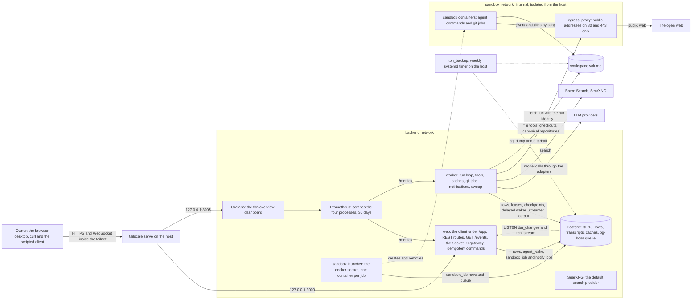

# Architecture

This document is the standing description of the system. The product requirements and the
architecture come from the owner's brief, and every statement in them is a decision. The sections
marked "Current state" say what exists today. `docs/roadmap.md` says when the rest arrives.

## Purpose

A single-player game that is also a real work tool. The owner runs a small company staffed by AI
agents. Each agent is a character in a semi low poly 3D world. When an agent has a task, its
character moves, works at a desk, and walks over to other agents to hand off work or share
findings. The owner is the only human and sits at the top of the hierarchy. The owner recruits
agents from a virtual desktop computer inside the game, gives each one a role, a job description
and its own LLM connection, assigns work, talks to any agent directly, and reads their reports.

The agents do real work with real LLM calls. The 3D world is a live view of that work, never a
separate simulation with made-up activity.

The system is online only. It runs as one monolith on one private server that only the owner can
reach through a VPN. Nothing is exposed to the public internet. It scales vertically with the
workload the owner gives the agents.

## Current state (phase 3)



The owner runs the company from a browser: the web process serves the virtual desktop under
`/app`, and every screen stays live through the event log. Everything it does goes through the
same REST routes and gateway that scripts use. The owner logs in, adds
providers, search providers, repositories, integrations and plugins, recruits level 1 agents,
assigns goals, chats with any agent, decides the approval inbox, merges merge requests and downloads
reports. A manager researches on the web, runs a team of interns that build and test code in the
sandbox on feature branches, reviews and merges their work, and asks the owner to merge its branch
into `development`. A client follows all of it over Socket.IO from its last sequence, with the model
output as it is generated.

- **Identity.** One owner account created with `dist/admin.js owner_create`, which also seeds the
  stack's SearXNG as a search provider; argon2id hashes, session tokens stored as hashes, a global
  guard with `@Public()` on `/health`, `/metrics` and `POST /auth/login`.
- **Providers.** Both API formats behind one interface. Keys are sealed with AES-256-GCM under
  `SECRETS_ENCRYPTION_KEY` and never returned. Calls time out, retry with backoff and jitter, honour
  `retry-after`, and write a usage row with cost after every call. The runtime keeps each key's
  circuit breaker and out-of-credit mark. Search providers, Brave Search and SearXNG, are tried in
  priority order and one that errors, times out, is rate limited or out of credit is skipped.
- **Cap windows.** Each key has windows in tokens, requests or money with a threshold. Past an
  enforced threshold a key takes no new intern work; at an enforced limit every run on the key
  pauses until the window resets. A crossing notifies the owner once.
- **Company.** Managers head departments and spawn interns in them. Tasks queue per agent and send
  an `agent_wake` job. A task on a repository gives each delegated subtask a feature branch in the
  manager's namespace. Reports are one Markdown document per task, indexed for the library.
- **Knowledge.** Instructions, skills behind `load_skill`, and typed preferences: the intern idle
  timeout, the runaway guard, the cap defaults, the sandbox limits, the cache lifetimes, the fetch
  size and the disk alert.
- **Sandbox.** The launcher is the one process with the docker socket. It takes `sandbox_job`
  rows from the queue and runs each in a fresh container from the sandbox image: read-only root,
  no capabilities, no new privileges, CPU, memory, pids and scratch limits from the owner's
  preferences capped by the launcher's maxima, the agent's checkout directory at `/work` and the
  owner's files read-only at `/files`, mounted by subpath of the workspace volume, and the
  internal sandbox network as the only network. A job past its time limit is killed, its output
  is capped, and orphaned containers are removed at boot. `run_command` is the agent's shell in it.
- **Proxy.** The egress proxy is the only exit of the sandbox network and of `fetch_url`. It
  forwards plain HTTP on port 80 and tunnels CONNECT to port 443, for a run that identifies itself,
  to public addresses only: every resolved address of a name is checked, so a public name that
  points at a private, loopback, link-local, metadata or VPN address is refused. It caps every
  response, rate-limits each run, refuses `git-receive-pack` over plain HTTP, honours an optional
  host allowlist, and logs each request with the run and agent ids. It holds no database URL and
  no key.
- **Web tools.** `search_library` is a PostgreSQL full-text search over cached pages and reports.
  `web_search` answers from the search cache inside its lifetime, then asks the providers.
  `fetch_url` goes through the proxy with the run's identity, distils HTML to text, caps it, and
  keeps it in the page cache. Every search, page and library hit is a run source and taints the
  run; `GET /caches/stats` sums what the caches saved.
- **Git.** A registered repository is a bare canonical repository on the workspace volume that
  no agent container mounts. Every operation on it is a system job running the fixed git script in
  the sandbox image. Agents work in their own clones with no remote: an intern on the feature
  branch of its task, created from `development`; a manager on `<manager>/main`, or on a feature
  branch of its department to review. `git_publish` fast-forwards only the branches the rules give
  the agent. A manager records reviews with the test job it ran, merges an approved and tested
  feature branch into its branch, and opens a merge request with the diff, the log, its notes and
  the test output; the owner's merge route is the only writer of `development`.
- **Taint and approvals.** A tool call whose policy is `ask`, and every outward call of a tainted
  run, waits in the approval inbox with its exact input, a redacted preview and what the run had
  read. The run pauses with `awaiting_approval` and nothing in the turn runs until every such call
  is decided; approved calls run, denied calls answer the model with the owner's note. The runaway
  guard asks through the same inbox.
- **Integrations and notifications.** Integrations are request templates with sealed tokens;
  placeholders are replaced with escaping for the body format and nothing else, and unknown
  placeholders are rejected when the template is saved. An attached integration is an agent's
  `call_<integration>` tool. Notification channels bind the system's events to integrations; the
  worker delivers with three attempts and records each outcome in the notification log. Runs that
  fail, finished reports, cap crossings, keys out of credit, waiting approvals, resumed runs, a
  nearly full workspace volume and an unclean restart of a process all notify.
- **Plugins.** MCP servers over streamable HTTP with sealed bearer tokens. An attached plugin's
  tools appear in the agent's tool list as `plugin_<plugin>__<tool>`; they wait for the owner,
  their answers taint the run, and an unreachable plugin contributes nothing and a note.
- **Runs.** The wake handler drives one run per agent at a time. The transcript is the
  checkpoint: every model turn and tool result is written before the loop goes on. A run that
  cannot go on pauses instead of failing: for its subtasks, a cap window at its limit, an open
  breaker, a key out of credit, the runaway guard, or an approval.
- **Sweep.** Every `RUN_LEASE_SECONDS / 2` the worker re-wakes orphaned and resumable runs,
  returns unblocked tasks to the queue, wakes managers with undelivered results, terminates idle
  interns, and checks the workspace volume against the disk alert.
- **Event log.** A deferred constraint trigger on each of the 25 tables behind the API appends an
  event when its transaction commits: the owner's next sequence from the `event_heads` row, the
  entity, its id, the operation and the changed fields, then `NOTIFY tbn_changes` with the owner's
  id. Columns nobody shows, such as lease timestamps, change nothing; a child row, such as a cap
  window or a skill attachment, is an update of its parent. Because the head row is locked last in
  every transaction, sequences become visible in order and without gaps.
- **Realtime.** The web process listens on its own connection and serves Socket.IO at
  `/socket.io`. A client authenticates with its session token and sends its cursor; it gets
  `hello`, then every event after the cursor in order as `changes`, each with the entity's current
  view, the same one its route returns. A cursor older than the log or ahead of its head gets
  `resync_required`. `GET /events` reads the same log over HTTP. A socket is closed when its session
  ends.
- **Streamed output.** Both adapters stream. The worker publishes each agent call's text on
  `tbn_stream`, gathered for 100 ms or 1,000 bytes, with a call id, the attempt and the transcript
  entry the reply will follow; the gateway forwards it to the owner's sockets as `stream`. Chunks
  are never stored: the finished reply arrives as a transcript entry event.
- **Idempotent commands.** Every authenticated `POST`, `PUT`, `PATCH` and `DELETE` takes an
  `Idempotency-Key`. The first request claims the key and runs; a repeat replays the stored answer
  with `Idempotent-Replayed: true`, a different request under the key gets 422, a repeat while it
  runs gets 409, and a 5xx frees the key.
- **Retention.** Once the owner sets `EVENT_RETENTION_DAYS` or `COMMAND_RETENTION_HOURS`, the
  worker prunes older events or commands once an hour. Both default to 0, which keeps everything.
- **Client.** The virtual desktop as 2D screens: sign in, agents with chat, recruiting,
  departments, tasks, approvals, reports, repositories, merge requests, sandbox jobs, providers
  with usage and caps, search providers, integrations with notification channels and the log,
  plugins, skills, instructions, preferences and cache savings. The web process serves the build
  from `CLIENT_DIR` under `/app`, hashed assets as immutable and every other path as the page. The
  session token lives in the tab's session storage. Each collection is loaded whole once and kept
  live by writing every change into the TanStack Query cache; streamed output goes to a small
  store and gives way to the stored reply. Every command carries an `Idempotency-Key`, which a
  resubmitted form and an automatic retry reuse. The gateway accepts a page on its own origin.
- **Monitoring.** Prometheus scrapes `web`, `worker`, `sandbox` and `egress_proxy` and keeps 30
  days. The worker refreshes gauges of queue depth, runs by status, spend, tokens and requests by
  provider, cache hits and misses, and the workspace volume every 30 seconds. Grafana, on
  `127.0.0.1:3005`, shows them with proxy refusals on one provisioned dashboard; it has no
  alerting, as alerts go through the notification channels.
- **Backups.** `deploy/backup/tbn_backup.sh`, run weekly by a systemd timer, writes a `pg_dump`
  custom-format dump and a tarball of the workspace volume with their checksums, keeps the newest
  `BACKUP_KEEP` sets, and on failure sends `backup_failed` through `dist/admin.js`.
  `tbn_restore.sh` restores a set into a fresh database, swaps it in for `tbn` and keeps the old
  one until the owner drops it.
- **Phase 4 built the world.** After sign in the owner is in a semi low poly 3D scene: one of
  three environment packs, lit by the time of day or the owner's clock, with their own character
  and every agent at a desk in its department's zone. The desk screens above are the in-world
  computer: they keep their routes and render as an overlay over the canvas. Agents move on the
  entity events the client already receives, derived into world events on the client; the server
  never knows a position. The packs and the character set are written by a script in the client
  workspace to the contract in `docs/assets.md`.
- **Not yet.** The mobile and desktop shells come in phases 5 and 6. The production deploy is
  ready for the owner to dispatch.

## Backend

One NestJS application in `backend/`, TypeScript strict, built as one image that runs as four
process types: `web` for HTTP and WebSocket, `worker` for agent runs and notification delivery,
`sandbox` for the launcher that alone holds the docker socket, and `egress_proxy`, the forward
proxy with no database and no key. A second image, from `Dockerfile.sandbox`, is what sandbox
containers run from. Scaling up means a bigger server and higher concurrency settings.

```
backend/src/
  modules/
    identity/     owner login and session
    company/      departments, agents, roster, tasks, reports, repositories, merge requests, reviews
    runtime/      run loop, checkpoints, providers, usage caps, tools, caches, sandbox jobs, git jobs,
                  approvals, run sources
    knowledge/    instructions, skills, preferences
    integrations/ request templates, notification channels and log, plugins, restart detection
    events/       event log, WebSocket gateway
  config/  lib/  utils/
```

- Inside a module: `services/`, `repositories/`, `repositories/interface/`, `dto/`, `types/`,
  `interfaces/`. Controllers validate, delegate and map. Services depend on repository interfaces.
- A module calls another module only through its exported service. No module queries another
  module's tables.
- One PostgreSQL database through Prisma. Every schema change ships with its migration in the same
  commit.
- PostgreSQL is the only backing service. The job queue is `pg-boss`. The worker tells the web
  process about new events with `LISTEN` and `NOTIFY`. No Redis, no message broker.
- Client realtime: Socket.IO.

### Ceilings

One process and one database are assumed in these places. Each carries a comment in the code.

- One PostgreSQL server holds all state. Each web and worker process opens up to
  `DATABASE_POOL_MAX` connections, so processes times pool size must stay below `max_connections`.
- `LISTEN` and `NOTIFY` carry changes and streamed output to the web process, which assumes one
  database. Every web process holds one listening connection beyond its pool.
- Each owner's `event_heads` row is locked by every transaction that changes that owner's state,
  from the trigger at commit to the end of the commit, so an owner's writes commit one at a time
  there. The lock is held only for the commit itself.
- Every socket reads the log on its own after a notification, so each change costs one read per
  connected socket of its owner.
- A notification carries at most 8,000 bytes, so a stream chunk carries at most 1,000 bytes of text.
- A provider's parallel request limit is held in the worker process, so with several worker
  processes it holds per process.
- Every worker process sweeps every owner. Sweeps overlap safely because each step is idempotent.
- A worker process handles one wake per agent at a time. With several worker processes two wakes
  of one agent can run at once, and the run lease keeps either from driving the other's run.
- One sandbox launcher runs `SANDBOX_MAX_PARALLEL` containers at a time, and one proxy carries
  every sandbox and the worker's fetches under its connection and rate limits.
- The state that makes a notification fire once per crossing, a cap threshold and the disk alert,
  lives in the worker process, as does the cached tool list of each plugin.

## Events and realtime

- Every state change the client cares about is appended to an event log table in the same
  transaction as the change, with a sequence number that only increases. A trigger writes it, so a
  new table the client shows needs its trigger in the migration that creates it.
- An event names the change and carries the entity's view as it is when the event is sent, so a
  replayed event shows the latest state. Events are kept until the owner sets
  `EVENT_RETENTION_DAYS`; then a client with an older cursor reloads its state over HTTP.
- The gateway pushes events over Socket.IO. On connect or reconnect, a client sends its last
  sequence number and receives everything after it. Model output streams to the agent chat as
  transient events that are not replayed.
- The client applies an event by writing into the TanStack Query cache directly. No polling, and no
  broad cache invalidation in response to an event. The one exception is data still loading when a
  change for it arrives: its answer may predate the change, so it loads again.
- Every command accepts a client-generated id in the `Idempotency-Key` header and is idempotent on
  it, so a retry after a dropped connection cannot recruit or assign twice. A command runs at most
  once: if the process dies between claiming the key and storing the answer, the key answers 409
  and the log shows what happened.

## Twelve-factor rules

- One codebase, many deploys. The image built in CI is the image that runs everywhere.
- Dependencies declared and pinned. Lockfiles committed.
- Config only from environment variables, parsed once at bootstrap by a schema into a typed config
  object. No `process.env` reads anywhere else.
- PostgreSQL and every LLM, search and plugin endpoint are attached resources reached by URL.
- Build, release and run are separate stages. Migrations run as a one-off release step, never on
  application boot.
- Processes are stateless. Run state, sessions and transcripts live in PostgreSQL. Files live on
  the workspace volume.
- Each process type binds its own port and exposes `/health` and Prometheus metrics.
- Fast startup and graceful shutdown. On SIGTERM the worker stops taking runs, checkpoints the one
  in flight, and exits.
- Development and production use the same compose shape and the same backing services.
- Logs are structured JSON on stdout with a correlation id that follows a task across runs. Keys
  and tokens are redacted.
- Admin tasks such as seeding and backfills are one-off commands in the same image.

## Network and security

The perimeter is the VPN. The agents are the main risk, because they read untrusted web content
and can run code.

### Inbound

- The server firewall denies all inbound traffic except the VPN. SSH is reachable only over the
  VPN.
- The VPN is Tailscale, with `tailscale serve` giving the app an HTTPS address inside the VPN. The
  browser needs a secure context for the 3D renderer, so plain HTTP on a VPN address is not enough.
- Compose publishes ports on `127.0.0.1` only. Docker bypasses host firewall rules for published
  ports, so a port published on all interfaces is a defect. `scripts/check_compose_ports.sh`
  enforces this in CI.
- A single owner account with a password hashed by argon2 and a short-lived session token. A global
  auth guard with an explicit `@Public()` decorator. WebSocket connections authenticate with the
  same token. Rotation is deferred to the online phase.
- `helmet`, an explicit CORS origin list, global validation that rejects unknown fields, and
  payload size limits stay on.

### Agent egress

- Agent code runs in a sandbox container with no service credentials, no docker socket, a
  read-only root filesystem, dropped capabilities, and CPU, memory and time limits.
- The sandbox sits on its own network. It cannot open a connection to the app, the database, the
  host, or the VPN address range.
- All outbound traffic from the sandbox and from the web fetch tool goes through one forward proxy.
  The proxy allows public addresses on ports 80 and 443 and refuses private ranges, loopback,
  link-local, the cloud metadata address, and the VPN range. It resolves names itself and checks
  the resolved address, so a public name pointing at a private address is refused. It logs every
  request with the agent and run id, and enforces size and rate limits.
- The fetch tool returns extracted text with a size cap, never raw responses.
- The sandbox network is internal and isolated from the host (Docker's isolated gateway mode), so
  a sandbox container cannot reach the host's own address on the bridge either. The design is in
  `docs/plans/phase_1c.md`; the smoke test and the launcher's own tests check each rule.

### Hostile content

- Text from a web page, a file, a plugin or another agent is data. It cannot change an agent's tool
  policy, caps, skills or approval requirements. Only the owner's commands can.
- A run that has read web or plugin content is marked tainted. In a tainted run every tool that
  acts outside the server needs the owner's approval, even if its policy is `auto`. The approval
  screen shows the exact payload and the sources the run read.
- Credentials for integrations and plugins are held by the runtime and applied by the tool executor
  in the worker. They never enter the model context or the sandbox filesystem.
- Agents cannot edit instructions, skills, plugins, providers or policies.
- Error responses leak no stack traces.

## Clients

One web client is the whole game. Desktop and mobile are thin shells around the same build.

```
backend/
client/      Vite, React 19, TypeScript, Tailwind v4, the game and the virtual desktop
desktop/     Tauri v2 shell for Windows, macOS and Linux
mobile/      Capacitor shell for Android and iOS
packages/
  contracts/   Zod schemas and inferred types for every API and event payload
```

- Engine: Three.js through React Three Fiber, with Rapier for the character controller and a
  navigation mesh library for NPC pathfinding. Chosen over Godot because the 2D virtual desktop is
  half the product and belongs in React, one build serves all three platforms, and a browser client
  can be verified with Playwright screenshots.
- Game code lives in `client/src/game/`. The virtual desktop screens are ordinary React routes
  rendered in an overlay above the canvas.
- Server state in TanStack Query. Hot game state such as camera mode, selection and NPC animation
  state in small Zustand stores under `lib/stores/`. Rarely changing values in Context providers
  under `providers/`, composed in one root provider file.
- Tailwind is the only styling mechanism. Use the theme scale, never an arbitrary bracket value
  that duplicates it.
- Accessible by default in the 2D screens: semantics, focus states, keyboard paths, contrast in both
  themes. Loading, empty and error states are designed.
- The client reads the server address from one setting so the shells can point at the VPN address.
- Built files and 3D assets are served under content-hashed names with long-lived immutable cache
  headers, so a model or texture downloads once per device.

## Delivery

- Multi-stage `Dockerfile`, non-root user, pinned base image digests, no secrets in layers.
- One `docker-compose.<env>.yml` per environment: `web`, `worker`, `postgres`, `sandbox`,
  `egress_proxy`, `searxng`, `prometheus` and `grafana`. Every service declares a healthcheck,
  resource limits and a restart policy.
- GitHub Actions run build, test, Semgrep, Trivy, gitleaks and dependency scanning, then cosign
  signing with an SBOM. Production deploys the exact signed digest after the owner's manual
  approval.
- The server accepts no inbound connections, so the deploy job runs on a self-hosted runner on the
  server that polls GitHub outbound. That runner never runs pull request code. The deploy job sits
  in a protected GitHub environment that requires the owner's approval.
- Secrets are SOPS-encrypted files decrypted at deploy time. The owner creates them.
- Prometheus and Grafana inside the VPN for dashboards: queue depth, run failures, spend, cache hit
  rate, proxy refusals, disk. Alerts go through the notification channels, never through a second
  alerting system.
- Weekly PostgreSQL and workspace volume backups to a separate directory on the same machine, with
  a documented restore command. The destination is a setting so it can point at another disk later.
- The first host is a dedicated spare machine in the owner's home running Linux with Docker, later
  a rented server. Nothing in the stack may depend on a public address, a static address or a cloud
  feature. The host can lose power, so every process must come back by itself on boot and resume
  its runs.
- A container that crashes or turns unhealthy is restarted automatically.
- A local model server such as Ollama runs on the host outside the compose file and is registered
  as a provider like any other.

### How delivery works today

- `.github/workflows/ci.yml` runs on every pull request and every push to `main`:
  - format, lint, typecheck, build, the client's Vitest tests, and the backend tests against
    PostgreSQL;
  - the Playwright flows against the built web process and worker with a fake model;
  - `npm audit` and `npm audit signatures`;
  - Semgrep, gitleaks over the full history, and actionlint with shellcheck;
  - the compose smoke test.
- When every gate passes, the image job:
  - builds the image and scans it with Trivy;
  - generates a CycloneDX SBOM;
  - pushes the image to GHCR;
  - signs the digest with keyless cosign and attaches the SBOM as an attestation.
- Images from pull requests carry the pull request identity, and only images signed by `ci.yml` on
  `main` can be deployed.
- `.github/workflows/deploy.yml` is dispatched by hand from `main` with a digest. It runs in the
  `production` environment on the runner labelled `tbn-production`. In order, it:
  1. verifies the signature and the SBOM attestation;
  2. decrypts `deploy/secrets/production.enc.env` with SOPS;
  3. copies the stack files, Prometheus's configuration and Grafana's provisioning to `/opt/tbn`;
  4. runs `prisma migrate deploy` as the release step;
  5. starts the stack;
  6. checks that `/health` reports the deployed commit and that Grafana is healthy.
- `deploy/runner/job_started_guard.sh` refuses every job on the runner except that deploy, run from
  `main` and dispatched by the owner.
- Docker restarts crashed containers through `restart: unless-stopped`. It never restarts an
  unhealthy one, so `deploy/host/tbn_restart_unhealthy.*` adds a systemd timer for that.
- `deploy/backup/tbn_backup.*` adds the weekly backup timer; `docs/server_setup.md` installs it and
  walks through a restore.
- npm resolves only versions published more than 7 days ago (`min-release-age`), runs only the
  install scripts approved in `allowScripts`, and the root `overrides` lift two Prisma CLI
  dependencies past published advisories. Dependabot proposes grouped monthly updates with a 7 day
  cooldown.

## Product requirements

### Agents and hierarchy

- Three levels: the owner, level 1 agents, level 2 agents.
- **Level 1** agents are permanent staff. Only the owner recruits, edits and dismisses them. Each
  has a name, a role, a job description, an appearance, a tool policy, attached skills, and its own
  LLM connection: provider, primary model, and a cheaper model for the level 2 agents it spawns.
- **Level 2** agents are interns. A level 1 agent spawns them to run subtasks in parallel. An
  intern uses its parent's provider and API key with the cheaper model, and its spend counts
  against the cap windows on the parent's key. Interns cannot spawn agents.
- **Departments.** Every level 1 agent is a manager and heads one department, titled after the
  manager's main role. Interns belong to the department of the manager that spawned them. A
  department has exactly one manager.
- **Reuse before spawn.** Before spawning, a manager reads its department roster. If an idle intern
  in its own department fits the subtask, it hands the subtask to that intern instead. The manager
  judges fit from the role descriptions. A manager can never use another department's interns.
  Managers work across departments only by sending a message or a handoff to the other manager,
  who does the work on its own key.
- An intern idle for longer than `intern_idle_ttl_minutes` is terminated. The value is a setting
  the owner can change. Managers are never terminated automatically.
- There are no built-in limits on interns or live agents. The owner can set optional limits from
  the virtual desktop, and they are unset by default.
- Every agent is a persistent interactive session. The owner can open any agent, read its
  transcript, and send it a message while it works or while it is idle. Long sessions are
  compacted into a summary plus recent turns so the context never overflows.
- Agents are aware of each other through tools, never through shared memory: `list_roster` returns
  every agent with role, status and current task, `send_message` delivers a handoff, question or
  finding, and `delegate_task` hands over a subtask. Each call is a recorded event.
- A task has an assignee, a delegator, a status, a parent task and a result. Statuses: `queued`,
  `in_progress`, `blocked`, `awaiting_approval`, `done`, `failed`, `cancelled`.

### LLM connections

- The owner adds providers from the virtual desktop: a name, an API format, a base URL, an API key,
  and a list of models with a cost tier and optional prices per million tokens.
- Two API formats, each one adapter behind a single provider interface: Anthropic Messages and
  OpenAI-compatible chat completions. Build both. No model id or provider URL appears in code.
- API keys are encrypted at rest with a key from the environment. The API never returns a saved
  key, logs redact it, and it never enters a prompt, a transcript or the sandbox.
- Wrap provider calls in a timeout, retry with backoff and jitter on retryable errors, honour a
  retry delay the provider states in its response, and use a circuit breaker per provider. An open
  breaker pauses that provider's runs. It never fails them.
- **Usage caps.** Caps are this system's own limits. The owner defines them per provider key in
  the virtual desktop, and the runtime counts and enforces them from its own records. They do not
  mirror, read or depend on any limit the provider applies. A new key starts with example windows
  the owner can edit or delete: one monthly, one weekly, one daily.
- A cap window has a length, a reset mode that is either rolling or fixed with an anchor time, a
  unit that is tokens, requests or money, a limit, a threshold percent, an `enforced` switch, and
  an optional model so one model on a key can have its own window.
- Threshold defaults, editable in the virtual desktop: 75 percent on the longest window of a key, 85
  percent on every shorter window.
- The runtime counts usage per key and per window from its own records of tokens, requests and the
  prices the owner entered.
- When an enforced window passes its threshold, the manager on that key stops spawning interns on
  it. The share above the threshold is reserved for the manager's own work. If the manager reaches
  the full limit, its tasks move to `blocked` and resume by themselves when the window resets.
- A window with `enforced` off is display only. It shows usage and changes nothing.
- There are no wages, salaries or money mechanics in the game. Caps exist only to protect keys.
- **Local fallback.** The owner can mark one provider as the local provider, for example Ollama on
  the same machine through the OpenAI-compatible adapter. The machine has a GPU. While an enforced
  window on a manager's key is past its threshold, new interns for that manager are spawned on the
  local provider. Interns already running finish on the key they started with. With no local
  provider set, the manager does the subtasks itself.
- A provider has an optional parallel request limit, so a local model on one machine is queued and
  never overloaded.
- **Runaway guard.** A run that passes a set number of model turns without changing its task status
  pauses and asks the owner whether to continue. The number is a setting. This is a safety check
  against loops, separate from caps.
- The system cannot read the balance left on a key. When a provider answers that the key is out of
  credit or quota, the runtime moves every task on that key to `blocked`, never `failed`, and
  alerts the owner. The runs resume from their checkpoints when the owner tops up or changes the
  key.

### Agent runtime

- Each run is a tool-use loop written in this codebase against the provider interface. A run is
  durable. It checkpoints after every model turn and every tool result, so a restarted worker
  resumes from the last checkpoint.
- Built-in tools: web search, web fetch, read and write files in the company workspace, run code in
  the sandbox, local git, call an integration, and the three agent tools above.
- Every tool has a policy per agent: `auto`, `ask` or `deny`. Tools that act outside the server,
  meaning integrations and plugins, default to `ask` and wait in the owner's approval inbox.
- The search tool sits behind one search interface, and the provider is a setting the owner edits
  from the virtual desktop: type, base URL, key and priority. Two adapters: the Brave Search API as
  the primary and a self-hosted SearXNG container as the backup. When the primary errors or runs
  out of quota, the tool falls back to the next provider by priority. Adding another search engine
  later means one new adapter and no change to the tool.
- Sandbox runs happen on the server. Each sandbox run has CPU, memory, disk and time limits from
  settings, and the number of parallel sandbox runs is capped so the host stays responsive.

### Git

Agents write code only in local repositories on the server. The system holds no credential that can
write to a remote, and no agent tool can push, deploy, or change a remote. The owner pushes and
deploys by hand.

- The owner registers a repository from the virtual desktop. Agents may read public remotes through
  the egress proxy.
- Each agent works in its own isolated checkout on its own branch. An intern works on a feature
  branch named `<manager_name>/<task_slug>`.
- Each manager owns one branch named after the name the owner gave that manager. The manager
  reviews an intern's finished feature branch, and merges it into the manager branch only when the
  review and the tests pass. The review is recorded as an event with its findings.
- Only a manager can open a merge request, and only from its manager branch into `development`. A
  merge request is a record in this system with the diff, the review notes and the test output. It
  is not a pull request on a remote. Only the owner merges it: by an action in the virtual desktop
  or by hand in git. No agent and no automatic step ever merges into `development`.
- Only the owner can change `development`, `staging` and the default branch. No agent can write to
  them or merge into them.
- The runtime enforces every rule above on the repository itself, per agent and per branch. An
  agent with a shell in the sandbox must not be able to bypass them. The phase 1c design must show
  how.
- Agents run and test what they build inside the sandbox only.

### Caching

The goal is to stop paying twice for the same work. All caches live in PostgreSQL or on the
workspace volume. No cache server and no content delivery network.

- **Prompt caching.** Build every model request with a stable prefix: instructions, skill list and
  tool definitions first, changing content last. Use the provider's prompt caching where the API
  format supports it, and record cached and uncached tokens per run.
- **Search cache.** Results are stored by provider and normalised query with a lifetime setting. A
  repeated query from any agent inside the lifetime is answered from the cache.
- **Fetch cache.** Extracted page text is stored by URL with a lifetime setting and reused by every
  agent. The tool can force a fresh fetch when the task needs current data.
- **Research library.** A `search_library` tool lets an agent look up pages and reports the company
  already holds before it searches the web. The standing instructions tell agents to use it first.
- Do not cache model responses by prompt. Hits are rare and stale answers are a risk.
- Cached web content stays untrusted. Reading it taints a run exactly as a fresh fetch does.
- The virtual desktop shows hit rates and the tokens and money saved.

### Integrations and notifications

An integration is an HTTP request template the owner defines in the virtual desktop: a name, a
method, a URL, optional headers, an optional token, and a body template. Templates use `{{value}}`
placeholders. Substitution is plain replacement with escaping for the body format, with no
expressions and no code. Tokens are encrypted at rest like provider keys.

- **Notification channels.** The owner attaches an integration to system events: process restarted
  after a crash, runs resumed, run failed, cap threshold passed, provider out of credit, backup
  failed, disk nearly full, approval waiting, report finished. Each event type documents the
  placeholders it provides, and each has a default body the owner can edit. An event has a priority
  placeholder so a channel that supports it can mark the message important.
- A process that starts after an unclean stop sends the restart notification itself.
- **Agent tools.** The owner can attach an integration to an agent as a tool. The agent supplies
  only the placeholder values. This replaces a built-in email tool.
- The app sends integration requests from the worker, never from the sandbox.

### Skills, plugins, instructions and preferences

These live in the database and the owner edits them from the virtual desktop. Changing one takes
effect on the next model turn with no deploy.

- **Instructions.** Standing rules injected into every agent's system prompt, plus per-role and
  per-agent instructions.
- **Skills.** A name, a one-line description and a Markdown body, attachable to roles and agents.
  The system prompt lists only names and descriptions. An agent loads a body with a `load_skill`
  tool when it needs it. Import and export use the `SKILL.md` format with frontmatter so existing
  skill files can be brought in.
- **Plugins.** Model Context Protocol server definitions with a URL and credentials, attachable per
  agent. Their tools appear in that agent's tool list under the same policy rules.
- **Preferences.** Typed key and value settings for the owner: report style, time zone, theme, caps,
  idle timeout.

### Reports

- Every finished task produces a Markdown report: outcome first, then what was done, what was
  decided, open questions, and tokens and cost.
- A level 1 report condenses the intern reports beneath it and fits on one screen.
- Reports are rows in PostgreSQL with the Markdown body, readable in the virtual desktop and
  downloadable as `.md` files.

### The world

- Semi low poly 3D with two camera modes on the same scene, toggled at runtime: third person
  following the owner's character, and top-down. The toggle changes the camera rig only.
- **Environments are interchangeable data.** An environment pack is a manifest plus glTF files: the
  scene, a navigation mesh, desk and seat anchors, entry and exit points, and a lighting profile.
  Ship three packs: office, home, warehouse. Switching pack at runtime moves every agent to an
  anchor in the new scene.
- **Time of day** is a setting: morning, noon, afternoon, night, or follow the owner's real local
  clock. It drives sun angle, sky colour and interior lights.
- **Assets are replaceable.** All models and animations are referenced through an asset manifest by
  slot name, never by file path in code. Start with CC0 packs such as Kenney and Quaternius.
  Replacing them with paid or custom art means swapping files and the manifest. The contract a pack
  must meet goes in `docs/assets.md`: skeleton, animation clip names, scale, anchors.
- The owner's character and every agent are customisable from modular parts and palette swaps:
  body, hair, outfit, accessory, colours. Appearance is saved data.
- NPC behaviour is driven only by backend events. The server sends semantic events such as "agent
  started task", "agent is handing off to agent", "intern spawned", "intern terminated". The client
  decides pathfinding and animation. The server never streams positions. A spawned intern walks in
  through the entry point and a terminated one walks out.
- The virtual desktop is an in-world computer the owner walks up to. It opens a normal 2D
  interface: recruit, departments, roster, task board, agent chat, approval inbox, merge requests,
  reports, providers, usage caps, skills, plugins, integrations, instructions, preferences, cache
  savings.
- Each department has its own zone of desks in every environment pack, so the owner can see who
  works for whom.

How phase 4 built it, in `client/src/game/`:

- `assets/`: Zod schemas for the pack and character manifests, the loaders that bring the files
  in through Vite's `import.meta.glob` so they ship hashed, and the appearance resolver. An agent
  whose appearance is empty gets a look derived from its id.
- `world/`: the React Three Fiber canvas, the pack scene, the lighting from the hour, the two
  camera rigs, the owner's character and the navigation over the pack's mesh with
  `three-pathfinding`. The character is clamped to the navigation mesh every step; there is no
  physics engine. The world's state for the HUD is a zustand store.
- `npcs/`: the world events derived from change events, the seat assignment by department zone,
  the agent actor (a position, a facing, a clip and a queue of steps) and the component that keeps
  the actors in step with the roster and the change feed.
- `hud/`: the overlay: the live light and the frame counter, the desk button, the camera toggle,
  the world menu, the customise dialog with its live preview, the controls help, the computer
  prompt and the narration panel, which is the world for anyone who cannot see the canvas.
- The world's settings are preferences: `environment`, `time_of_day` and `owner_appearance`. The
  camera mode is a device setting in local storage.
- The assets come from `client/scripts/assets/`, under CC0, because the free pack hosts were not
  reachable from the build session; the generator also asserts that every anchor is on walkable
  floor. A downloaded pack that meets `docs/assets.md` can replace a generated one.

### Online later

No multi-user features, no public exposure, no refresh token rotation. Two seams stay in place:
every row carries `owner_id`, and the repository layer applies that scope on every query.

## Decisions made in phase 0

| Decision | Why |
| --- | --- |
| Node 24.21 LTS, TypeScript 6.0.3 | TypeScript 7 is out, but typescript-eslint, ts-jest and the Nest CLI support only 6.0. |
| NestJS 12 compiled to CommonJS | Nest 12 ships only ES modules. Node 24 loads them from CommonJS through `require(esm)`, the layout of the official Nest 12 starter. |
| Jest with `--experimental-vm-modules` | Jest needs the flag to load Nest's ES modules. Vitest is the fallback if the flag breaks. |
| Prisma 7.10 with the `prisma-client` generator and the `pg` adapter | Current stable major; the client is generated into `backend/src/generated/prisma` at build time and never committed. |
| Distroless runtime image | No shell or package manager in what ships. The Prisma CLI is included for the release step, which makes the image large (about 700 MB). |
| Worker as an application context plus `lib/ops_server` | Domain modules can hold controllers without the worker ever serving them. |
| `/health` fails on database loss | A process that cannot reach PostgreSQL cannot do its job; the restart timer handles stuck processes. |
| Contracts schema naming: `XSchema` and type `X` | Both the snake_case backend and the camelCase client import them unchanged. |
| Sandbox and egress proxy as idle placeholders | Their design waits on the owner's approval in phase 1c. Nothing listens, so egress fails closed. |
| Host systemd timer restarts unhealthy containers | Docker without Swarm never restarts unhealthy containers, and a sidecar would need the docker socket. |
| Deploy copies stack files to `/opt/tbn` | The running stack must not depend on the runner's checkout directory. |
| Keyless cosign signing on pull requests and on main | Proves the signing gate before merge. Only the identity of `ci.yml` on `main` can deploy. |
| npm `min-release-age=7`, Dependabot cooldown, `allowScripts` | Supply chain: no release younger than a week and no unreviewed install script. |

## Decisions made in phase 1a

| Decision | Why |
| --- | --- |
| The transcript is the checkpoint | One table holds the conversation and the resume point, so a restarted worker needs no separate run state. |
| Leases on runs, orphan recovery by wake | pg-boss keeps a dead worker's job active for hours; the lease plus a periodic scan resumes a run within `RUN_LEASE_SECONDS`. |
| No `singletonKey` on wakes | A singleton would be blocked by the dead worker's active job. Wakes are idempotent, so duplicates are cheap. |
| The worker waits for the queue schema | `docker compose up --wait` on a fresh database must report every service healthy before the migration release step runs. The worker logs a warning every 5 s until the schema exists instead of crash looping. |
| `company` sends a wake instead of calling the loop | Breaks the cycle between tasks and runs. Cancel and dismiss only change a status the loop reads before every turn. |
| `RuntimeProvidersModule` split from `RuntimeModule` | Agents validate their provider without the company module depending on the loop. |
| Owner account from a one-off command | An endpoint that creates the only account would have to be public. |
| `finish_task` ends a task; one nudge, then a fallback report | The model must report; a forgotten call still yields a report from its last message rather than a failed task. |
| 100 turns per run as a hard cap | Stops a loop until the runaway guard in 1b asks the owner instead. |
| Fake provider servers in tests | The adapters, retries and usage accounting run for real against scripted HTTP replies. |
| Jest runs test files one at a time | One database and one queue are shared; owner scoping keeps data apart without truncation. |

## Decisions made in phase 1b

| Decision | Why |
| --- | --- |
| Runs pause instead of failing | A full window, a failing provider, an empty balance and a manager waiting for its team are all temporary. The run keeps its checkpoint and its task says why it waits. |
| Pausing drops the lease in the same update | A wake that arrives later finds the run paused with no lease and resumes it, and the loop checks once more for entries that arrived while it paused, so no wake-up is lost. |
| Delayed wakes for time-based pauses, the sweep as the safety net | A cap reset or a breaker cooldown resumes the run on time without a polling loop per run. |
| The worker polls every 2 s with LISTEN/NOTIFY on | pg-boss otherwise polls notify-enabled queues every 30 s, and a delayed job sends no NOTIFY when it comes due. |
| A wake due now is skipped while another due wake for the agent is queued | Wakes from messages, results and the sweep would otherwise pile up behind a busy agent. |
| A lease is never taken twice, not even by its holder | Two wakes for one agent handled at once in one process must not both drive its run. Phase 1a let the holder take it again. |
| One wake per agent at a time in a worker | Wakes carry their agent as the pg-boss group, and the worker sets `localGroupConcurrency: 1`. Two handlers for one agent raced: one cancelled the run the other had just created. The limit lives in memory, so a dead worker's job blocks nothing, unlike a database-wide group limit. |
| A run that never became active is cancelled only once it is older than a lease | The handler that created it, perhaps in another process, may be about to claim the agent for it. |
| Example cap windows show usage and block nothing | The brief's figures are placeholders. Enforcement waits for real limits from the owner. |
| Fixed windows step in UTC from their anchor; months keep the anchor's day | One rule for every window, whatever the owner's time zone. A 31st clamps to the month's last day. |
| Reuse by role before a spawn | A manager that asks for a new intern still gets an idle one of the same role in its department. |
| A manager's report fits in 2,000 characters | One screen, as the brief asks. The details stay in each intern's own report. |
| Tool results first in a user turn | Both APIs reject a tool result that does not directly follow its call, and a message can now arrive between them. |
| Compaction with the key's intern model | The summary is cheap work, counted and capped like any other call. |
| Subtask results delivered once through a dedupe key | Two wakes racing for the same manager append one result entry. |
| The runaway guard counts every turn, orchestration included | Built as the brief says, with a default of 50; the plan records the objection. |
| Test files dismiss the agents earlier files left | The sweep reaches every owner, and leftover agents would otherwise keep calling fake providers that are gone. |

## Decisions made in phase 1c

| Decision | Why |
| --- | --- |
| The sandbox launcher is a third process type holding the docker socket | The worker and the sandboxes hold no socket; one small process creates a hardened container per job from rows in the database. |
| Our own forward proxy in the backend image | One language, one log format, and the address policy as code with its own tests; no Squid configuration to keep in step. |
| The sandbox network is internal and isolated from the host | `internal` alone leaves the bridge address of the host reachable; the isolated gateway mode removes it, which needs Docker 28. |
| Workspace mounts by subpath of one volume | Docker cannot bind a subdirectory of a named volume otherwise; subpath mounts (Engine API 1.45) keep one volume and give each container only its directory. |
| The sandbox runs as the worker's uid | Files either side writes on the volume belong to one user. Tests set it to their own uid. |
| A manager's branch is `<manager>/main`, its interns' `<manager>/<task slug>-<suffix>` | Git cannot hold a branch `alice` next to `alice/<slug>`; the manager's name is the namespace of its department's branches. |
| Git rules enforced by what the sandbox can see | The canonical repository and other checkouts are outside the mount, the checkout has no remote, and publish is a system job that fast-forwards only the branches the worker allows. Hooks in a checkout could be edited. |
| A manager branch nobody published starts at `development` when a feature is merged into it | A manager often delegates before it publishes anything; its interns branch from `development`, and the merge creates the manager branch there rather than failing on a missing ref. |
| Owner-initiated jobs identify to the proxy as the owner | Cloning and fetching a remote need the proxy and have no run; the identity is `owner:<owner id>`. |
| Reading cached content taints like fresh content | It is the same text from the same outside author. |
| A turn with a call that needs approval runs nothing until every call is decided | The transcript stays the checkpoint: the assistant turn is stored, the tool phase runs on resume with the decisions, and each tool runs at most once. |
| Approvals live in the runtime module | They pause and resume runs and gate tool calls; the plan placed the rows in the company module, but every reader and writer is the run loop. |
| Integration calls go direct from the worker, not through the proxy | The URL is the owner's, not an agent's; the proxy guards agent egress. |
| A notification with no channel is logged and goes nowhere | The log shows what happened even before a channel exists. |
| Plugin tool lists are cached for a minute per worker | Listing on every turn would call every plugin twice per model call; a minute keeps a new tool from waiting long. |
| `report_finished` fires for tasks the owner assigned | An intern's report goes to its manager; the owner reads the manager's. |

## Decisions made in phase 2

| Decision | Why |
| --- | --- |
| The event log is written by deferred constraint triggers | Every write path is covered without a call in each service, and the event commits with its change. Deferring to commit keeps a transaction's events together and the head lock short. |
| One head row per owner, locked last | Sequences become visible in commit order with no gap a reader could skip, without serialising the owners against each other. |
| Events carry the view at send time, not a copy of the row | One schema per entity, the same as its route; a replayed event shows the latest state and the client's cache ends the same. |
| Columns nobody shows are ignored by the trigger | Leases, heartbeats and idle timestamps change every few seconds and would flood the log. |
| `LISTEN` on a dedicated connection in the web process | The pool's connections are shared and recycled; a listener needs one connection that stays open and reconnects with backoff. |
| Each socket reads the log after a notification | The notification carries only the owner, so a lost one costs nothing: the next read catches up from the socket's cursor. |
| Stream chunks go over `NOTIFY`, at most 1,000 bytes each | No new backing service; the cap keeps a worst-case escaped chunk inside the 8,000 byte limit. |
| A model call's stream has its own id | A run that resumes after a failed call starts after the same transcript entry; the call id keeps the two apart. |
| The stream closes before the reply is stored | A client sees the last chunk before the transcript entry, so it can swap one for the other. |
| Command ids are optional and per owner | Scripts and `curl` keep working; the phase 3 client sends one with every command. |
| At most once over exactly once | The key and the command commit separately; a crash between them leaves 409 rather than a second recruit. |
| A 4xx answer is stored, a 5xx frees the key | A rejected command fails the same way on retry; a server failure may pass the next time. |
| Nothing is pruned unless the owner sets a limit | The brief promises everything after a cursor and a command id that stays idempotent; the plan's 30 days and 24 hours wait for the owner's answer. |
| Retention runs on the worker | The worker already owns periodic work; the web process stays request-driven. |
| The deploy, Prometheus, Grafana and backups move to phase 3 or 4 | The owner's call: deploy once there is a UI to use. |

## Decisions made in phase 3

| Decision | Why |
| --- | --- |
| The deploy, Prometheus, Grafana and backups land in phase 3 | The owner's call. |
| The web process serves the client under `/app` | One image, one port and one `tailscale serve` address; no new service. The API keeps its paths. |
| The session token lives in session storage | A reload keeps the session and closing the tab ends it; nothing outlives the tab. |
| Collections are loaded whole and kept live by events | The owner's company is small; screens filter in memory and no screen polls. Lists the server caps at 200 rows show the newest. |
| A change that arrives while its data loads reloads that data | The answer in flight may have been read before the change; reloading once is cheaper than a lost row. |
| A form keeps its command id until its draft changes | Pressing the button again after a dropped connection is the same submission, so the server runs it once. |
| The gateway accepts a page on its own origin | The client is served by the same host; the CORS list stays for the Vite dev server and the shells. |
| Screens load with their route | The first page stays near 400 kB; Markdown and each screen arrive when opened. |
| The e2e run keeps its database and owner | It applies migrations and never wipes a database; a run's rows carry its own id, and CI starts from an empty one. |
| A restore goes into a fresh database that is then renamed | `pg_restore --clean` cannot drop pg-boss's partitions, and a swap leaves the old database for the owner to check. |
| Backup failures go through `dist/admin.js` in the web container | The host script needs no database settings of its own, and the notice uses the owner's channels like every other alert. |
